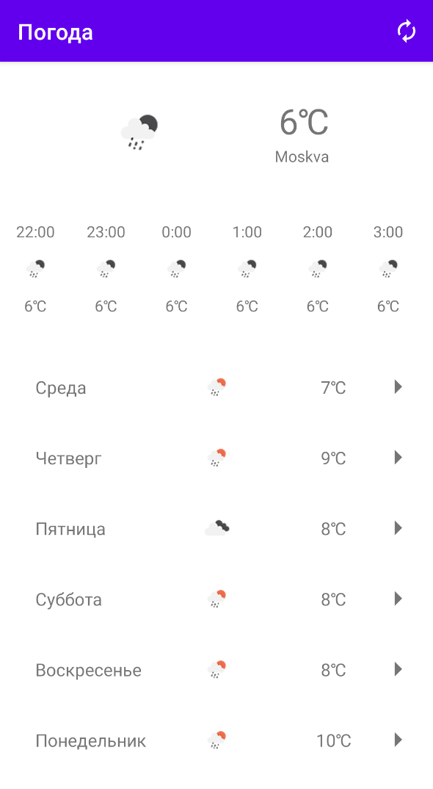
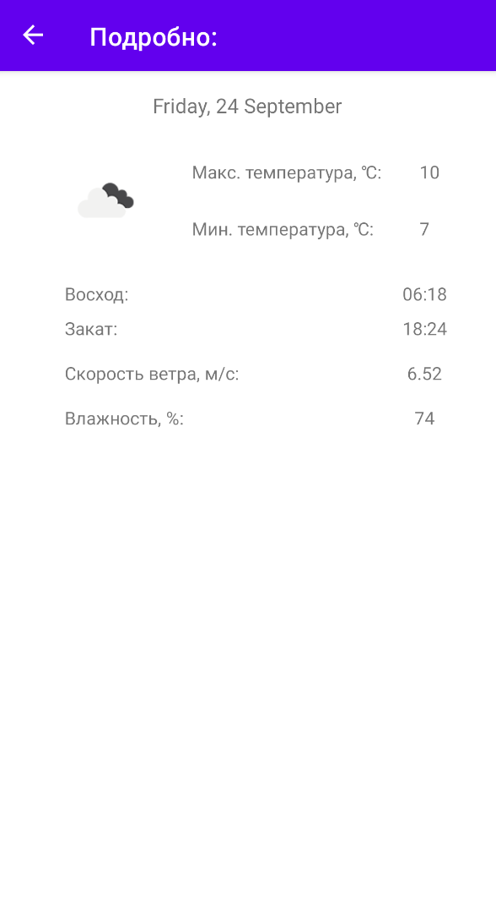

# Weather
Weather project

  

 
### Description
Weather app is a small project that uses *OpenWeatherMap API* for displaying weather in users current location. Location permission is required.

App uses **Single Activity, DataBinding & MVVM** architecture with repositories as a model layer. **Dagger2** is used for dependency injection. 
Network requests are performed using **Retrofit** library with **Moshi**. Requested DTO is converted into database entity and domain model.  
Persistent storage is done with **Room**. Data transfer object is inserted into a databse after a request while displayed data is taken from database tables.  
Background threading is performed using **Kotlin Coroutines**.
### Libraries and Dependencies
- RecyclerView 
- Jetpack Navigation
- Play Services Location
- Kotlin Coroutines
- Room
- Retrofit + Moshi
- Glide
- Dagger2